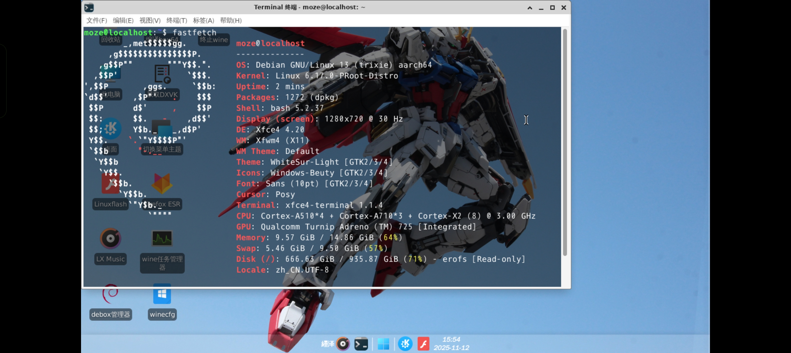
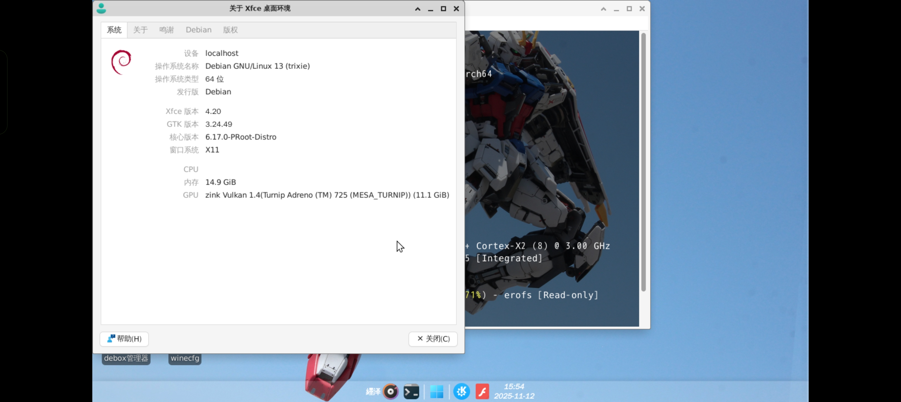
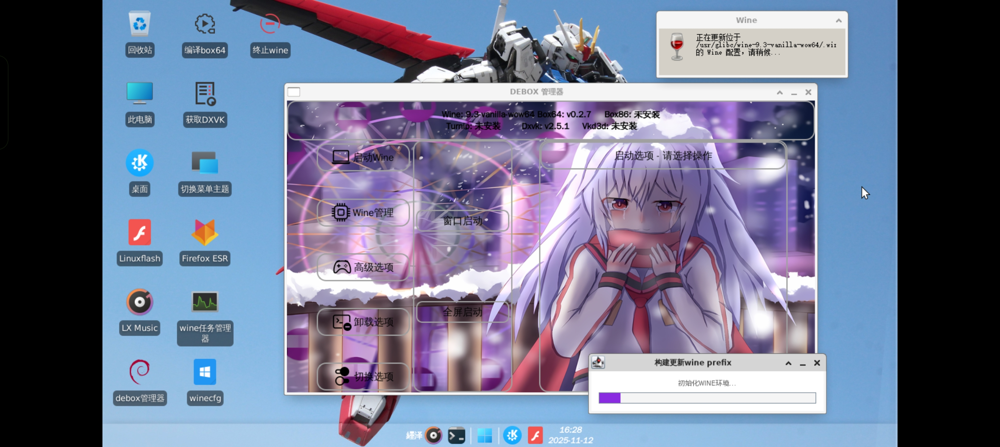

  
  
  # Debox OS

一个用于在termux上使用debian环境调用termux-glibc环境使用box64+wine的组合运行Windows程序的系统。

---

### 容器环境

  
  
<em>debian系统信息</em>

### xfce4

  
  
<em>桌面环境</em>

### 桌面菜单

  
  
<em>Debox管理器</em>

## 前置依赖

### Termux终端应用程序
- [原版Termux](https://github.com/termux/termux-app/releases/download/v0.118.3/termux-app_v0.118.3+github-debug_arm64-v8a.apk)（官方原版Termux应用程序）
- [ZeroTermux](https://github.com/hanxinhao000/ZeroTermux/releases/download/ZeroTermux-0.118.3.49/ZeroTermux-0.118.3.49-arm64-v8a-release.apk)（可实现多容器共存的多功能终端）
- [一体式终端](https://github.com/jiaxinchen-max/termux-app/releases/download/1.0.7/termux-app_v0.118.0+f53af15+apt-android-7-github-debug_arm64-v8a.apk)（终端与x11融合版本，无需担忧终端在后台的性能损耗）

### X11显示
官方[原版x11下载](https://github.com/termux/termux-x11/releases/download/nightly/app-arm64-v8a-debug.apk)

## 获取Debox OS途径
### 123云盘（提取码bucP）
    https://www.123865.com/s/9SK6Vv-Gi2JH?
### 百度网盘（提取码9p5r）
    https://pan.baidu.com/s/1rB3QDjdZ5g54rpWYvEgIGg?pwd=9p5r 

## 使用方法
### 把debox.sh、debox-termux.tar.gz、debox-glibc.tar.gz、debox-debian.tar.gz四个文件下载好，把他们移动到手机根目录下，确保终端已经获得储存权限，如果未获得储存权限请手动给予，在termux终端中输入
    bash /sdcard/debox.sh
即可开始安装，修复系统配置部分需要网络连接，请确保正常连接网络。

## 注意事项
### 1、如果在配置wine结束后有未能启动tfm或虚拟桌面的情况，请重新在菜单中再启动一次.
### 2、在xfce4的环境中，如果在“此电脑”的文件管理器里面双击运行exe发现无法启动，请直接使用Debox菜单中的虚拟桌面启动游戏。
### 3、当切换box64或box86有报错提示文件繁忙，请运行桌面的终止wine后再进行切换。
### 4、启动Debox管理器和启动虚拟桌面都需要一到两秒的时间加载和调用，请耐心等待。

## 开发者名单
### @纆泽@咔咔龙@Asai@阿飞(afei)@Deemo@Fox

## 使用到的第三方库
- [Termux](https://github.com/termux/termux-app)
- [ZeroTermux](https://github.com/hanxinhao000/ZeroTermux)
- [一体式终端](https://github.com/jiaxinchen-max/termux-app)
- [DXVVK](https://github.com/doitsujin/dxvk)
- [WineHQ](https://www.winehq.org/)
- [MESA 3D](https://mesa3d.org/)
- [GStreamer](https://gstreamer.freedesktop.org/)
- [glibc-packages](https://github.com/termux-pacman/glibc-packages)
- [BOX64](https://github.com/ptitSeb/box64)
- [BOX86](https://github.com/ptitSeb/box86)
